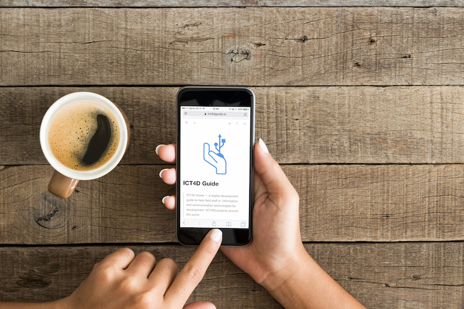

# About

> "The future is already here — it's just not very evenly distributed." — William Gibson

Digital technologies change how we engage with the world.

Modern devices play a critical role in how we communicate. They are key in all the ways that we speak to each other, how we remember information, and how we learn.

They carry information from one place to another, whether it's through airwaves, undersea cables, or satellite signals.

The reach is important, vast, and complicated.

But the tools and technologies themselves aren't going to make things better themselves. The tools are neutral—they are as capable of dividing, harming, and increasing inequality.

It's up to **us** to make sure that we use technology in ways that make the world a better place.

## Why the Guide

This guide hopes to help anyone who wants to use technology to make the world a slightly better place. 

This guide should help you whether if you work in international development, community organizing, entrepreneurship, university student—everyone.

My hope in putting this together was that could be something in it for everyone. There are items that may seem too simple, and others that are too advanced. That's ok -- it's a good place to learn, to grow, and hopefully, to teach!

## Guide Background

I began writing this guide as a simple way to organize my own resources along the way in my fieldwork.

I wanted to use the opportunity of making this resource more public as a way to extend that reach even further.

Additionally, I'm hoping to learn from those who read it to provide feedback so that I can learn even more along the way.

If we have been successful, we will play a part in 'more evenly distributing the future' among the present.

Let's get started!

