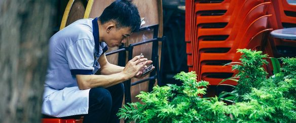

# Digital Literacy

- [Digital Literacy](http://digitalliteracy.us) — [US Department of Education](https://www.ed.gov/) site focusing on links and resources around digital literacy.

- [Mozilla Learning Network](https://learning.mozilla.org) — Lessons and platforms from Mozilla on everything from basic and advanced digital literacy, privacy, programming, and more — also has some incredible online and offline teaching activities.

- [Equal Access](http://www.equalaccess.org) — International not for profit organization in San Francisco working throughout Asia, Africa and the Middle East on communications for social change organization that combines the power of media with community mobilization.

- [Mobile for Development](https://gsma.com/mobilefordevelopment) — Group within [GSMA](https://www.gsma.com) that brings together mobile operator members, the wider mobile industry and the development community to drive commercial mobile services for underserved people in emerging markets.

- [TASCHA (Technology and Social Change Group)](https://tascha.uw.edu) — Group at the University of Washington Information School that explores the design, use, and effects of information and communication technologies in communities facing social and economic challenges.

- [Powertyping](https://powertyping.com) — Full lessons and exercises to learn touch typing or improve your typing skills. Include many entertaining typing games, tests and practice drills.

- [Digital Learning Basics](https://oercommons.org/courses/digital-learn) — Really solid collection of courses on a range of discrete topics having to do with basic computer use.

- [Microsoft Digital Literacy](https://microsoft.com/en-us/digitalliteracy) — Microsoft's education site with a few number of interesting lesson plans around basic computer use.

- [Digital Literacy.gov](https://digitalliteracy.gov) — From the [US Department of Commerce](https://www.commerce.gov) – free tutorials, skills assessments, and other resources for educators and users curated from organizations around the U.S.

- [DigitalLearn](https://digitallearn.org) — [Public Library Association](http://www.ala.org/pla) website that serves as an online hub for digital literacy support and training.

- [GCLearnFree](https://gcflearnfree.org) — Essential digital skills — over 125 tutorials, including more than 1,100 lessons, videos, and interactives.

- [Learn My Way](https://learnmyway.com) — UK-based organization that offers free tutorials in technology, reading, math, and everyday life.

- [Vital Voices](https://www.vitalvoices.org) — Organization with focus on women through long-term investments that expand skills, connections and visibility, to accelerate women efforts.

- [Womanity](https://www.womanity.org) — Empower girls and women to shape their future and accelerate progress within their communities.

- [World Pulse](https://worldpulse.com) — Action media network powered by women from 190 countries, seeks to lift and unite womens' voices to accelerate their impact for the world through programs (online communities, magazine and online campaigns).

- [Alliance for Affordable Internet (A4AI)](https://a4ai.org) — Coalition of more than 80 organizations across civil society, public and private sectors working to enable access to the Internet.

- [Steve Song's Awesome Connectivity Info](https://github.com/stevesong/awesome-connectivity-info) — List of connectivity indexes and reports to help you better under who has access to communication infrastructure and on what terms.
